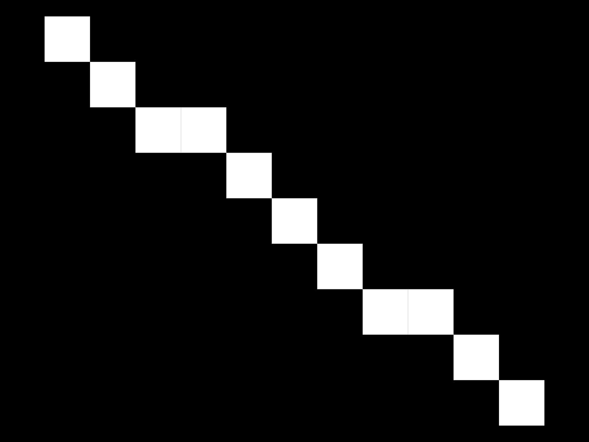

# research
A repository where I store information I know and explain using photographs.

# Bresenham's line algorithm (short version)
```
  void dda(int x0, int y0, int x1, int y1) {
  int dx = abs(x1-x0);
  int dy = abs(y1-y0);
  int sx = x1 < x0 ? 1 : -1;
  int sy = y1 < y0 ? 1 : -1;
  int err = dx - dy;
  while(1) {
    if (x0>=0 && x0<HW && y0>=0 && y0<HW) buf[y0][x0]='1';
    if (x0==x1 && y0==y1) return;
    int e2 = err*2;
    if (e2 > -dy) { err-=dy; x0+=sx; }
    if (e2 < dx ) { err+=dx; y0+=sy; }
  }
}
```

This algorithm draws a line without using complex mathematical calculations and employs only integers.
Here is a rough example in photo:
<p align="center">
  
</p>

# Algorithm DDA (Digital Differential Analyzer)
```
  void dda(float x0, float y0, float x1, float y1) {
  float dx = x1 - x0;
  float dy = y1 - y0;
  float steps = fabs(dx) > fabs(dy) ? fabs(dx) : fabs(dy);
  float step_x = dx / steps;
  float step_y = dy / steps;
  for (int i=0; i<(int)round(steps); i++) {
    int px = (int)round(x0);
    int py = (int)round(y0);
    if (x0>=0 && x0<HW && y0>=0 && y0<HW) buf[py][px]='1';
    x0+=step_x;
    y0+=step_y;
  }
}
```
This algorithm uses floating-point numbers and is excellent for understanding the fundamentals of drawing lines in pixels.

###### Yes, the result is almost the same as that of Bresenham's algorithm, but DDA is not optimized.
<p align="center">
  
</p>

# Midpoint circle algorithm
```
void midpoint(int px, int py, int r) {
  int x=0, y=r, err=1-r;
  while(x<=y) {
    draw_pixel(px+x,px+y);
    draw_pixel(px+x,px-y);
    draw_pixel(px-x,px+y);
    draw_pixel(px-x,px-y);
    draw_pixel(px+y,px+x);
    draw_pixel(px+y,px-x);
    draw_pixel(px-y,px+x);
    draw_pixel(px-y,px-x);
    x++;
    if (err<0) err+=2*x+1;
    else { err+=2*(x-y)+1; y--; }
  }
}
```
In computer graphics, the midpoint circle algorithm is a method used to determine the points required to rasterize a circle. It is a generalization of Bresenham's line algorithm.
<p align="center">
  
</p>
